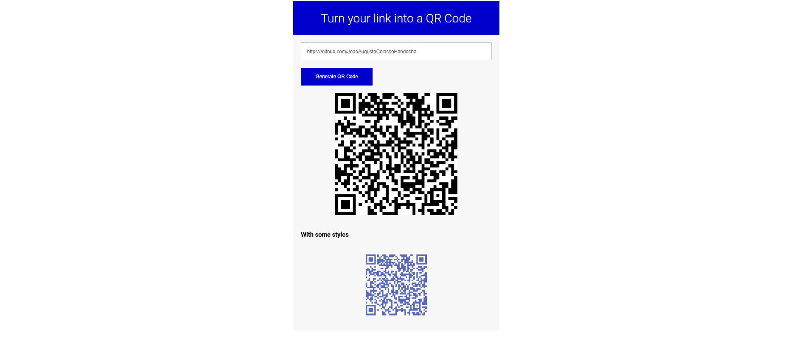

# QR Code

The website consists of a system for transforming a link into a QR Code.

Languages ​​used:

- **HTML**
- **CSS**
- **JAVASCRIPT**

#

To access the website, [Click here](https://joaoaugustocolassohandocha.github.io/QR-Code/)

#

